# Administrator Guide — Business Sign-off for Jira Data Center

**Version:** 1.0
**Last Updated:** February 22, 2026
**Vendor:** Cahaba Forge LLC

---

## System Requirements

| Requirement | Version |
|---|---|
| **Jira Data Center** | 10.3.0 – 10.7.x |
| **Java** | 17 (OpenJDK or Oracle JDK) |
| **Databases** | PostgreSQL 13+, MySQL 8.0+, Microsoft SQL Server 2019+, Oracle 19c+ |
| **Browsers** | Chrome 90+, Firefox 90+, Safari 15+, Edge 90+ |
| **Cluster** | Supports 1-node through multi-node Data Center deployments |

---

## Installation

Business Sign-off is distributed as a ZIP file containing the plugin JAR, a detached signature, a vendor certificate, and documentation. Extract all files from the ZIP to a folder on your Jira server:

| File | Purpose |
|------|---------|
| `business-signoff-X.Y.Z.jar` | The plugin |
| `business-signoff-X.Y.Z.sig` | Detached signature (proves the JAR is authentic) |
| `cahabaforge-cert.pem` | Cahaba Forge vendor certificate (one-time trust store import) |
| `admin-guide-X.Y.Z.html` | This guide (configuration, REST API reference, troubleshooting) |
| `user-guide-X.Y.Z.html` | End-user guide (approving/returning issues, viewing sign-off status) |
| `INSTALL.html` | Quick-start installation instructions |

### Before You Begin

- Jira Data Center 10.3+ required
- Jira admin permissions required
- Steps 1 and 2 below only need to be done once (skip if already completed)

### Step 1: Add the Cahaba Forge Certificate to the Jira Trust Store

#### Jira 10.3 – 10.4 — SKIP

UPM does **not** support app signing in Jira 10.3 or 10.4. Skip directly to Step 2.

#### Jira 10.5 – 10.7 — OPTIONAL

Jira 10.5 through 10.7 ships with UPM app signing support, but it is **disabled by default** during a grace period. The plugin will install without the certificate unless your administrator has explicitly enabled signature verification.

**You only need to install the certificate if:**
- Your Jira administrator has enabled app signing by setting `-Datlassian.upm.signature.check.disabled=false` (or using the UPM configuration), **or**
- You want to set it up now for a future upgrade to Jira 11.x

If neither applies, skip to Step 2. Otherwise, follow the certificate installation steps below.

#### Jira 11.x — REQUIRED

Starting with Jira 11, UPM app signing is **enabled by default**. You **must** install the Cahaba Forge certificate before uploading the plugin.

#### Certificate Installation Steps

*Only required on first install — skip if already done.*

1. Copy `cahabaforge-cert.pem` from the ZIP to your Jira server
2. Place it in: `<jira-home>/upmconfig/truststore/`
   - If these directories don't exist yet, create them and set read-only permissions:
     ```
     mkdir -p <jira-home>/upmconfig/truststore
     chmod 555 <jira-home>/upmconfig/
     chmod 555 <jira-home>/upmconfig/truststore/
     ```
   - If they already exist, skip the above — the permissions are already correct
3. Set the certificate file to read-only:
   ```
   chmod 444 <jira-home>/upmconfig/truststore/cahabaforge-cert.pem
   ```
4. No restart required — UPM picks up the certificate automatically

> **Tip:** Not sure where `<jira-home>` is? In Jira, go to **Administration > System > System Info** and look for the **Jira Home Directory** entry.

### Step 2: Enable Plugin Upload (if the Upload Button is Hidden)

*Only required once — skip if you already see the "Upload app" button.*

Starting with Jira 9.4.17 / 10.x, the upload button is hidden by default.

1. Open `<jira-install>/bin/setenv.sh` (Linux) or `setenv.bat` (Windows)
2. Find the line that sets `JVM_SUPPORT_RECOMMENDED_ARGS` and append this flag:
   ```
   -Dupm.plugin.upload.enabled=true
   ```
   For example, if the existing line is:
   ```
   JVM_SUPPORT_RECOMMENDED_ARGS="-Xss512k"
   ```
   Change it to:
   ```
   JVM_SUPPORT_RECOMMENDED_ARGS="-Xss512k -Dupm.plugin.upload.enabled=true"
   ```
3. Restart Jira
4. The "Upload app" button will now appear in Manage Apps

> **Tip:** Atlassian recommends disabling this after upload for security. You can remove the parameter and restart after installing. You will need to re-enable it again for future upgrades.

### Step 3: Install the Plugin

1. Log in to Jira as a system administrator
2. Go to **Administration > Manage Apps**
3. Click **Upload app**
4. Select `business-signoff-X.Y.Z.jar` from the ZIP
5. If UPM prompts for a signature file, upload `business-signoff-X.Y.Z.sig`
6. Click **Upload** — Jira installs the plugin
7. No restart required

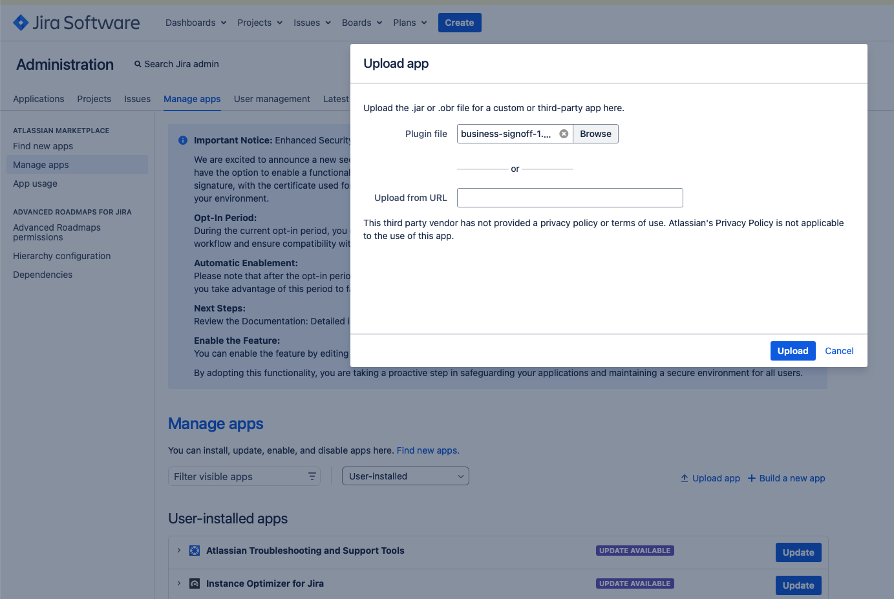

### Step 4: Verify Installation

1. Go to **Jira Administration > Manage Apps**
2. Find **Business Sign-off** in the list of User-installed apps
3. Verify the version number matches: X.Y.Z
4. The plugin is now active and ready to configure

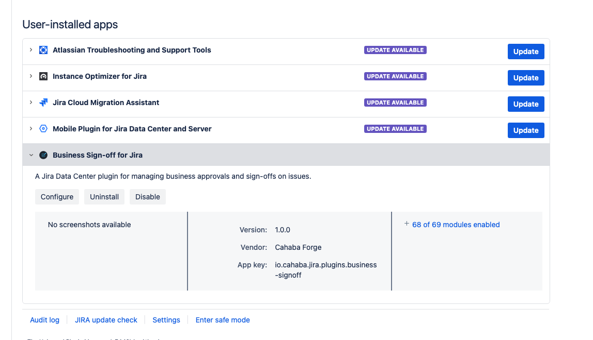

### Upgrading

For future upgrades, only Step 3 is needed. The certificate (Step 1) persists across upgrades. If you removed the `-Dupm.plugin.upload.enabled=true` parameter after the initial install (as recommended in Step 2), you will need to re-enable it before uploading the new version, then remove it again afterward.

### Alternative: File System Installation

If you prefer not to use the UI upload:

1. Copy `business-signoff-X.Y.Z.jar` to: `<jira-shared-home>/plugins/installed-plugins/`
2. Jira detects the new plugin automatically (all cluster nodes)
3. Note: File system installs bypass signature verification

---

## Licensing

Business Sign-off uses a custom license framework. Licenses are managed through a dedicated License Administration page, separate from the Atlassian UPM.

### Accessing the License Page

- From the global configuration page, click the **Manage License** link in the License Summary section
- Direct URL: `/plugins/servlet/signoff/admin/license`

Only **Jira System Administrators** can access this page.

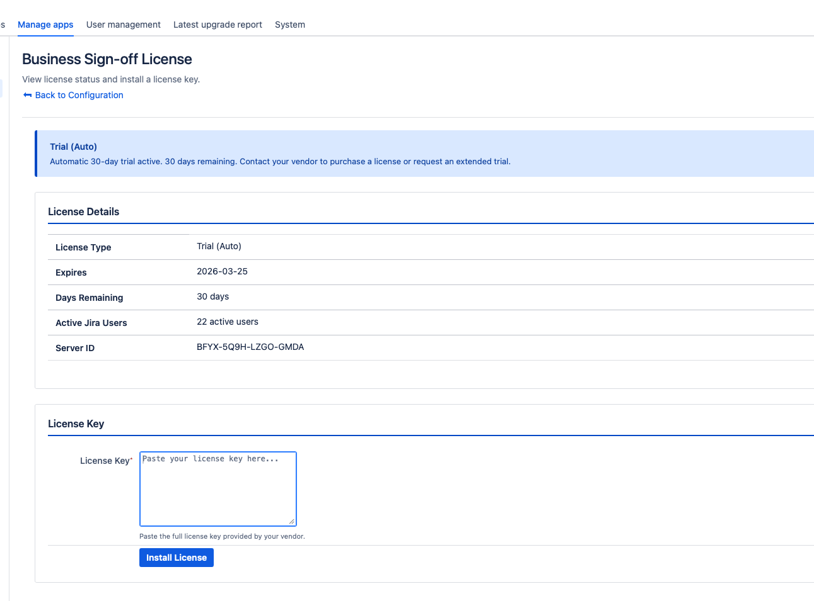

### License States

| State | Behavior |
|---|---|
| **Valid** | All features enabled (active paid license) |
| **Evaluation** | All features enabled during the trial period. On first install, the plugin automatically activates a 30-day auto trial. A signed trial license also returns this state. |
| **Grace Period** | Paid license has expired but within the 30-day grace period; all features remain enabled with a warning banner. Grace period applies to paid licenses only — expired trials go directly to Expired. |
| **User Mismatch Grace** | Active user count exceeds licensed seats; within the 30-day grace period with a warning |
| **Expired** | License expired and grace period ended (or trial expired); plugin enters read-only mode — existing data is preserved but write operations are blocked |
| **User Mismatch** | Seat overage past grace period; read-only mode |
| **None** | No license installed and no auto trial active; plugin is non-functional (fail-closed) |
| **Invalid** | License key is present but cannot be validated (bad signature, wrong server ID, etc.) |

### Applying a License

1. Go to the License Administration page (see above)
2. Paste your license key into the **License Key** text area
3. Click **Install**
4. The page refreshes and displays the updated license details

The plugin immediately reflects the new license state. No restart required.

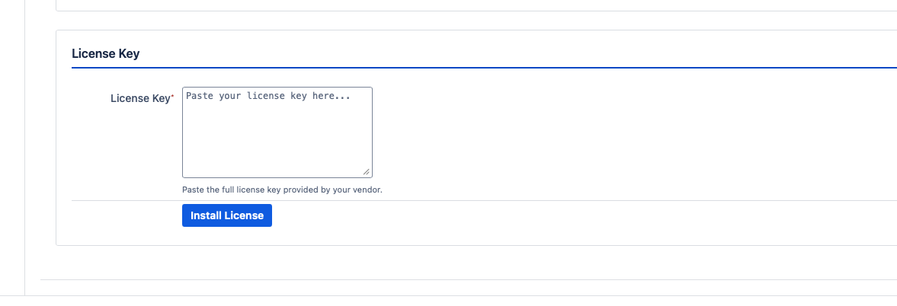

### License Details

When a signed license is installed, the license details table shows:

- **Licensee**: The organization or individual the license is issued to
- **License ID**: Unique identifier for the license
- **Type**: Paid or Trial
- **Issue Date**: When the license was issued
- **Expiry Date**: When the license expires
- **Days Remaining**: Countdown to expiry
- **Seats**: Maximum licensed users (or Unlimited)
- **Active Users**: Current active user count in Jira
- **Licensed Server ID(s)**: Server IDs the license is valid for, with a checkmark next to the current server
- **Current Server ID**: This Jira instance's server ID

### License Notifications

The plugin sends email notifications to Jira system administrators when license issues arise:

- **Expiring soon**: Notifications at 30, 7, and 1 day(s) before expiry
- **Grace period**: Weekly warnings plus alerts at 7 and 1 day(s) before grace ends
- **Read-only transition**: Notification when the plugin enters read-only mode
- **Seat overage**: Same notification schedule as expiry

---

## Global Configuration

Access the global configuration page from:
- **Jira Administration > Manage Apps > Business Sign-off Plugin > Configure**
- Direct URL: `/plugins/servlet/signoff/admin/global-config`

Only **Jira System Administrators** can access this page.

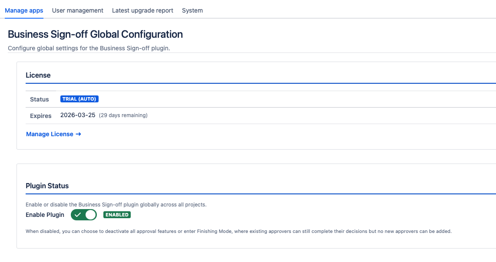

### Plugin Enable/Disable

Toggle the **Enable Plugin** switch to activate or deactivate Business Sign-off globally. When disabled:
- All approval operations are blocked
- Issue panels are hidden
- Existing data is preserved (non-destructive)

**Finishing Mode**: When disabling the plugin globally, you are prompted about pending approvals across all projects. You can choose to:
- **Remove all pending approvers** — immediately removes all ADDED/PENDING approvers from every project
- **Allow pending approvals to finish** (Finishing Mode) — the plugin enters a transitional state where existing approvers can still complete their decisions, but no new approvers can be added. Once all pending approvals are resolved, the plugin fully disables.

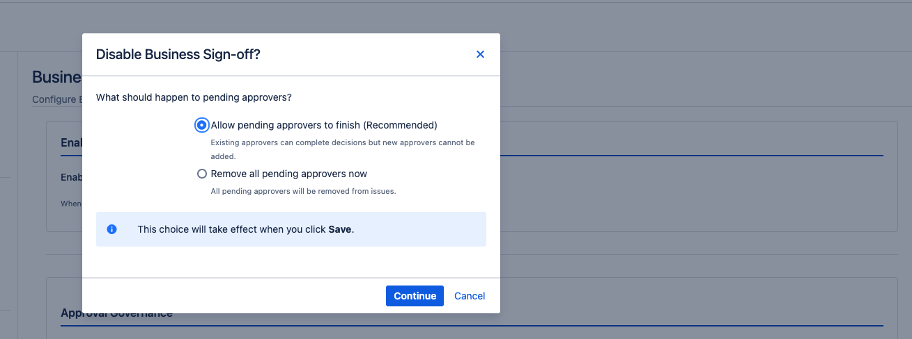

### Post-Enable: Full Re-index Required

After enabling the plugin for the first time (or re-enabling after an extended period), a **full Jira re-index is required** so that the BSO - Status custom field is indexed for all existing issues. Without this re-index, JQL queries using `"BSO - Status" IS EMPTY` or `IS NOT EMPTY` will not return pre-existing issues.

To run a re-index:
1. Go to **Jira Administration > System > Indexing**
2. Click **Re-Index** (foreground or background)
3. Wait for completion

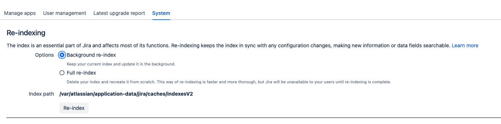

### Approval Threshold

Set the global default percentage of approvals required for an issue to pass:

| Threshold | Meaning |
|---|---|
| **50%** | Simple majority |
| **66%** | Two-thirds majority |
| **75%** | Three-quarters majority |
| **90%** | Near-unanimous |
| **100%** | Unanimous |

**Allow project override**: When checked, project administrators can set a different threshold for their project, subject to the minimum threshold floor.

**Minimum threshold**: Sets the lowest threshold a project can configure (prevents projects from setting an inappropriately low bar).

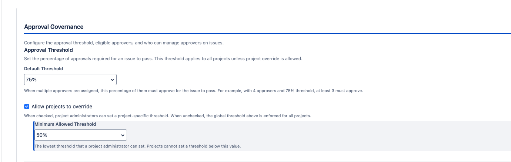

### Segregation of Duties (SoD)

Configure which issue participants cannot serve as approvers:

- **Issue assignee cannot be an approver**: When enabled, the person assigned to work on the issue cannot approve it
- **Issue reporter cannot be an approver**: When enabled, the person who created the issue cannot approve it

**Allow project override**: When checked, project administrators can set different SoD rules for their project.

SoD violations are enforced at the API level — the plugin will reject any attempt to add a restricted user as an approver or record their decision. Violations are logged in the audit trail with a `FAIL` SoD result.

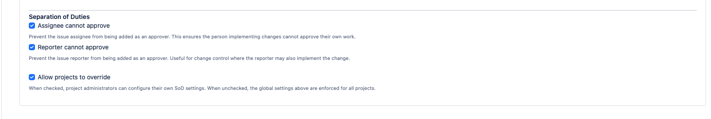

### Comment Requirements

Configure when approvers must provide a comment with their decision:

| Option | Behavior |
|---|---|
| **All decisions** | Comment required for both approvals and returns |
| **Approvals only** | Comment required only when approving |
| **Returns only** | Comment required only when returning |
| **Never** | Comments are optional |

**Allow project override**: When checked, project administrators can set different comment requirements.

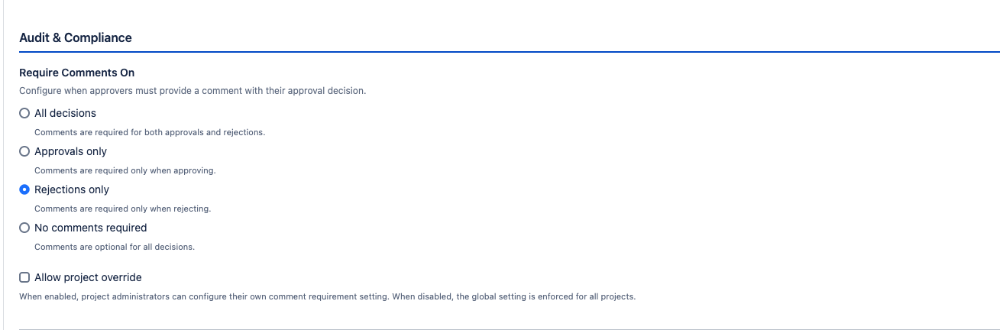

### Eligible Approver Controls

Restrict who can serve as an approver across the instance:

**Mode**:
- **All Users**: Any Jira user with EDIT permission on the project can be an approver
- **Selected Users**: Only users matching the configured filters can be approvers

**Filters** (OR logic — user must match at least one enabled filter):
- **Project Roles**: Select one or more project roles. Users in any of the selected roles for the issue's project are eligible.
- **User Groups**: Select one or more Jira groups. Users in any of the selected groups are eligible.

**Fail-open safety**: If filters are misconfigured (e.g., selected role doesn't exist in a project, or no users match), the plugin falls back to allowing all users with EDIT permission. This prevents approval deadlocks.

**Allow project override**: When checked, project administrators can configure different eligible approver filters.

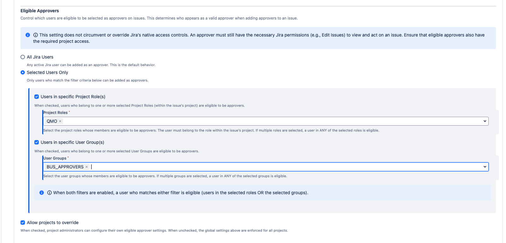

### Approver Management Permissions

Configure who can add and remove approvers on issues:

- **Issue reporter** (checkbox): Allow the person who created the issue to add and remove approvers
- **Issue assignee** (checkbox): Allow the person assigned to the issue to add and remove approvers
- **Jira administrators (system and project)** (checkbox): Allow Jira system administrators, Jira administrators, and project administrators to add and remove approvers

**Note:** At least one of these checkboxes must be selected. Workflow automation (post-functions, Automation for Jira) and system automation accounts can always add and remove approvers regardless of these settings.

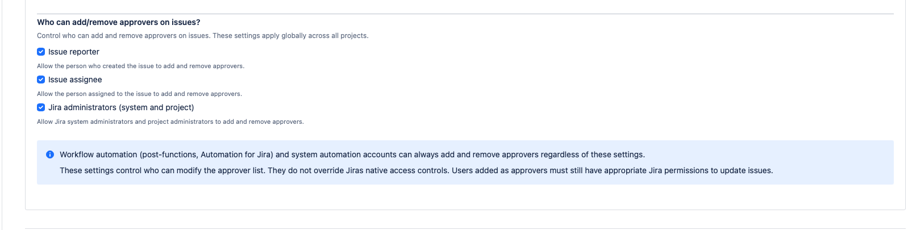

### Debug Logging

Enable detailed DEBUG-level logging for troubleshooting. Debug logging automatically expires after the configured duration to prevent excessive log growth.

Toggle on, set the expiry duration (5 minutes, 30 minutes, 1 hour, 2 hours, 4 hours, 8 hours, or 24 hours), and reproduce the issue. View logs in Jira's application log (`atlassian-jira.log`). All plugin log entries use the `io.cahaba.jira.signoff` logger prefix.

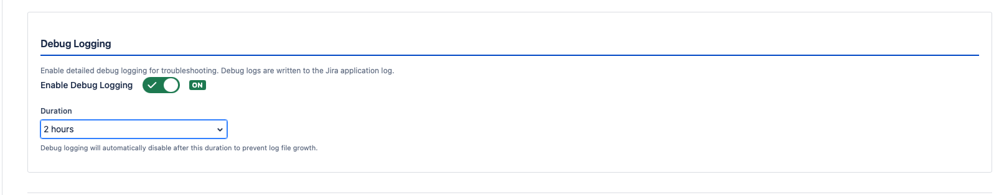

### Audit CSV Export

Export approval history data to CSV format for offline analysis or auditor delivery.

1. Select one or more projects (required)
2. Select the date range (required)
3. Click **Start Export**
4. Monitor the progress bar
5. Click **Download** when complete

Exports are generated as background tasks and tracked in the database. CSV files are written to the Jira shared home directory and are accessible from any cluster node.

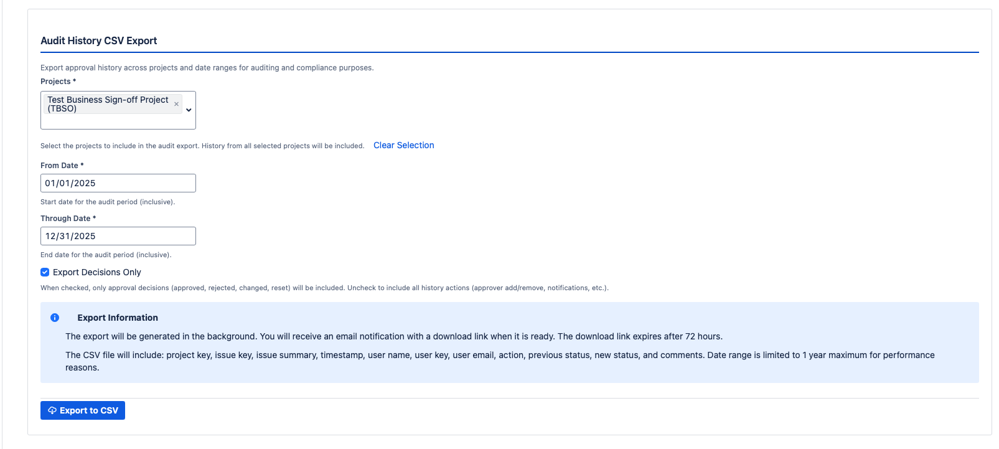

---

## Project Configuration

Access project-level settings from:
- **Project Settings > Business Sign-off** (sidebar link)
- **Project Settings > Summary** (Business Sign-off panel)

Only **Project Administrators** can access project configuration.

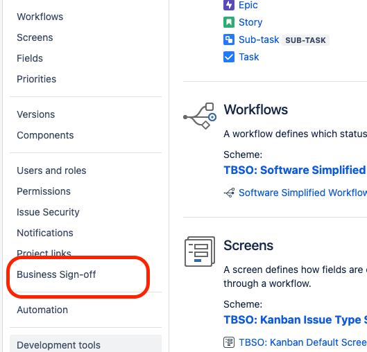

### Enable for Project

Toggle Business Sign-off on or off for a specific project. When disabled:
- The issue panel is hidden for all issues in the project
- No new approvers can be added
- Existing approver data is preserved

**Finishing Mode**: When disabling a project, you are prompted about pending approvals. You can choose to:
- **Remove all pending approvers** — immediately removes all ADDED/PENDING approvers from issues in the project
- **Allow pending approvals to finish** (Finishing Mode) — the project enters a transitional state where existing approvers can still complete their decisions, but no new approvers can be added. Once all pending approvals are resolved, the project fully disables.

### Require Approvals

Separate from the Enable toggle, the **Require Approvals** switch controls whether approval workflows are enforced for the project. When disabled:
- The sign-off panel is still visible (if the project is enabled)
- Workflow conditions and validators that check for approvals will **not** block transitions
- Useful for projects that want the panel visible for optional approvals without enforcing them in workflows

Both the Enable and Require Approvals toggles must be on for full approval enforcement.

### Panel Visibility

Choose which issues show the Business Sign-off panel:
- **All Issue Types**: Panel appears on every issue in the project
- **Selected Issue Types**: Panel appears only on chosen issue types (e.g., "Story", "Bug")

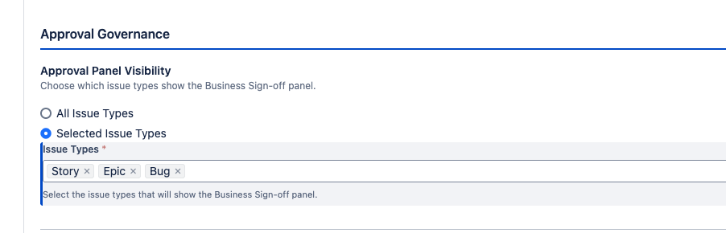

### Email Notification Settings

Email notification preferences are configured at the project level:

- **Email approver when added**: Send notification to approvers when they are assigned
- **Email requestor on outcome**: Notify the person who requested the approval when the overall result is reached (configurable: Approved Only, Returned Only, Approved or Returned, Never)
- **Email requestor on each decision**: Notify for each individual approval/return (configurable: Approved Only, Returned Only, Approved or Returned, Never)
- **Email assignee on outcome**: Notify the issue assignee on the final approval result (configurable: Approved Only, Returned Only, Approved or Returned, Never)
- **Email assignee on each decision**: Notify the assignee for each individual decision (configurable: Approved Only, Returned Only, Approved or Returned, Never)

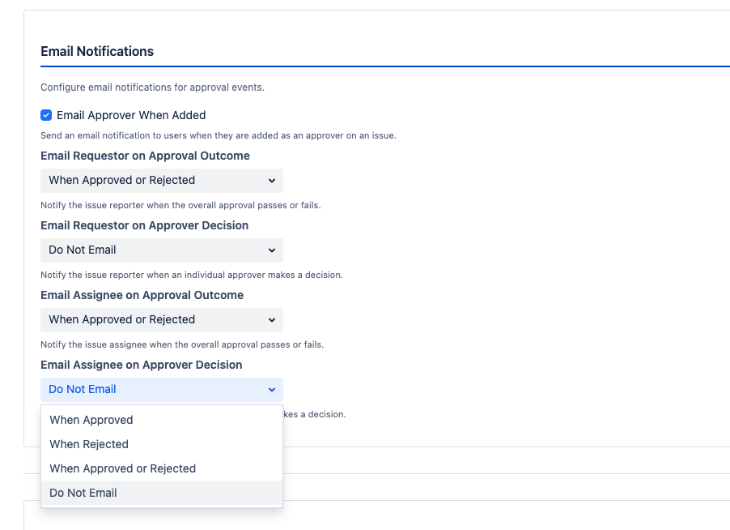

### Project Overrides

If allowed by the global configuration, project administrators can override:
- Approval threshold
- SoD rules (assignee/reporter restrictions)
- Comment requirements
- Eligible approver filters

Settings left at their default (null) inherit the global value. Explicitly set values override the global default.

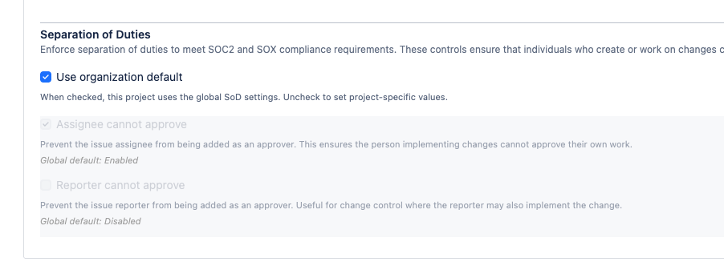

---

## Setting Up Approval Workflows

### Step 1: Enable the Plugin Globally

1. Go to global configuration
2. Toggle **Enable Plugin** to ON
3. Configure SoD rules, threshold, and other defaults

### Step 2: Enable for Your Project

1. Go to **Project Settings > Business Sign-off**
2. Toggle **Enable** to ON
3. Toggle **Require Approvals** to ON (if you want workflow conditions/validators to enforce approvals)
4. Configure panel visibility and any project overrides

### Step 3: Add Workflow Functions (Optional)

For automated approval enforcement, add workflow functions to your project's workflow:

#### Adding a Workflow Condition

1. Go to **Jira Administration > Workflows**
2. Edit the target workflow
3. Select the transition you want to gate
4. Click **Conditions** > **Add Condition**
5. Select one of:
   - **Issue has Approvers (Business Sign-off)**: Transition available only if at least one approver is assigned
   - **Issue is Approved (Business Sign-off)**: Transition available only if approval threshold is met
   - **Issue is Returned (Business Sign-off)**: Transition available only if approval has failed

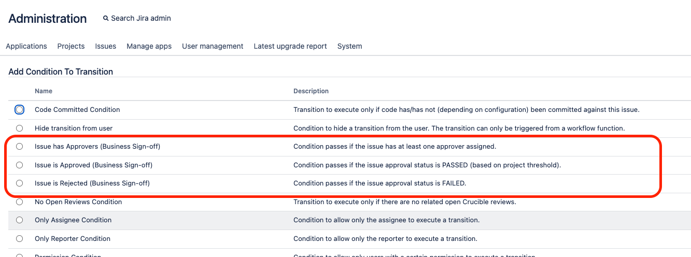

#### Adding a Workflow Validator

1. On the same transition, click **Validators** > **Add Validator**
2. Select one of:
   - **Require Approvers Assigned (Business Sign-off)**: Block transition unless approvers are assigned
   - **Require Approval Passed (Business Sign-off)**: Block transition unless approval passed
   - **Require Group/Role Approval (Business Sign-off)**: Block transition unless approvers from specific groups and/or roles have approved. Configure required groups and roles in the validator settings — at least one approver from each configured group/role must have approved.

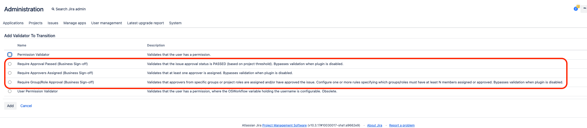

#### Adding a Workflow Post-Function

1. On the transition, click **Post Functions** > **Add Post Function**
2. Select one of:
   - **Add Approvers (Business Sign-off)**: Automatically add approvers when the transition fires. Supports four sources: specified user keys, users from a custom field, users in a project role, or users in a group.
   - **Remove Approvers (Business Sign-off)**: Remove approvers from the issue. Supports two modes: remove specific users (by user key) or remove all approvers.
   - **Notify Approvers (Business Sign-off)**: Send email notification to all pending approvers
   - **Reset Approval Status (Business Sign-off)**: Reset all approver decisions to Pending. Optionally sends a notification to all approvers after reset.

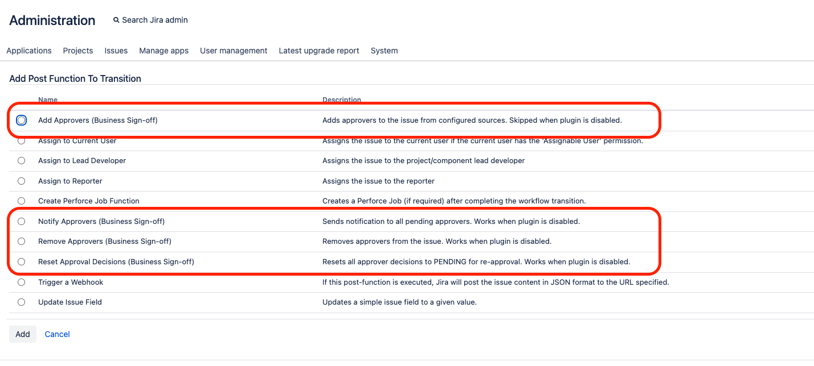

### Step 4: Configure Custom Fields (Optional)

Add the BSO - Approvers and BSO - Status custom fields to your screens:

1. **Create the fields** (done automatically on first plugin enable if they don't exist):
   - Go to **Jira Administration > Custom Fields**
   - Verify "BSO - Status" and "BSO - Approvers" exist

2. **Add to Field Configuration**:
   - Go to **Jira Administration > Field Configurations**
   - Edit your project's field configuration
   - Ensure both BSO fields are visible (not hidden)

3. **Add to Screens**:
   - Go to **Jira Administration > Screens**
   - Edit the appropriate screen (View, Edit, Create)
   - Add "BSO - Status" (recommended: View screen only, since it's read-only)
   - Add "BSO - Approvers" (recommended: Create and Edit screens for approver selection)

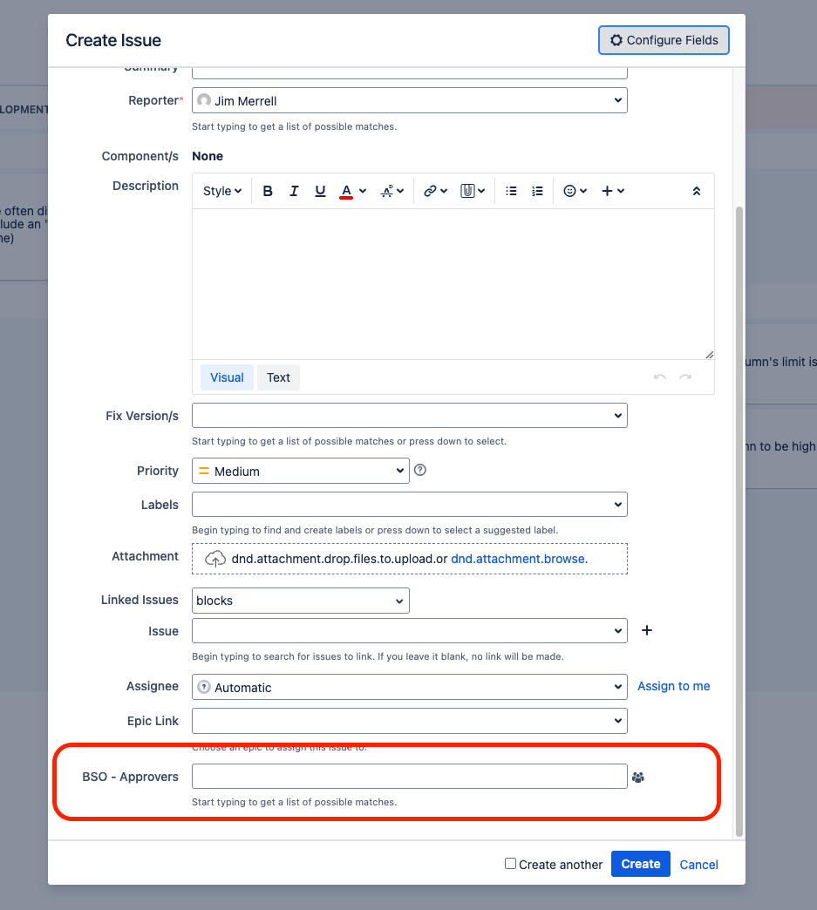

---

## Configuring Segregation of Duties

SoD is a key compliance control. Here's how to set it up for different compliance frameworks:

### For SOC 2 Type II

Recommended configuration:
- Enable "Assignee cannot be an approver" globally
- Enable "Reporter cannot be an approver" globally
- Set threshold to 100% (unanimous) or 75%+ depending on your controls
- Use the "Require Approval" workflow validator on production deployment transitions

### For SOX (Sarbanes-Oxley)

Recommended configuration:
- Enable both SoD rules globally
- Set eligible approvers to "Selected Users" filtered by a designated approver group
- Use "Require Group/Role Approval" validator to ensure approvers from specific departments sign off
- Enable audit CSV export for quarterly compliance reporting

### Verifying SoD Enforcement

SoD is enforced at the API level. To verify it's working:

1. Assign yourself as the issue assignee
2. Try to add yourself as an approver — the plugin should reject this with a "Segregation of Duties" error
3. Check the audit trail — the failed attempt is recorded with `sodResult: FAIL`

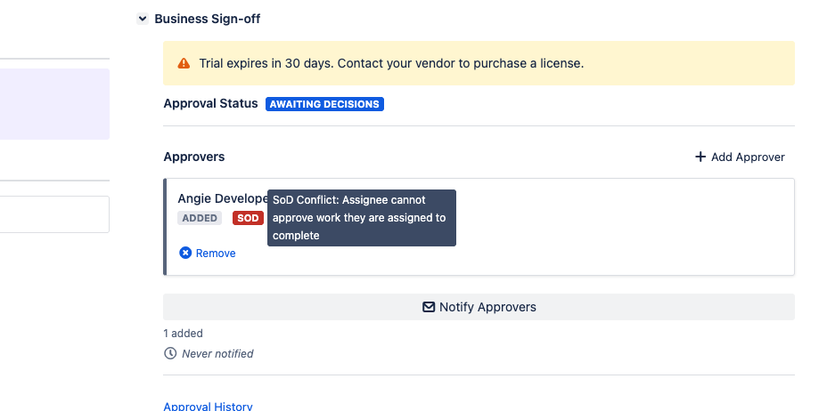

---

## Email Notification Configuration

Business Sign-off uses Jira's built-in mail system. Ensure your Jira instance has outgoing mail configured:

1. Go to **Jira Administration > System > Outgoing Mail**
2. Verify an SMTP mail server is configured and enabled
3. Send a test email to confirm delivery

The plugin sends notifications using Velocity email templates. No additional email configuration is needed beyond Jira's standard mail setup.

### Notification Types

| Event | Recipients | Configuration |
|---|---|---|
| Approver added | The added approver | Toggle on/off |
| Approval requested (bulk) | All pending approvers | Triggered via REST API or post-function |
| Approval reminder | Pending approvers | Triggered via REST API |
| Decision made | Reporter, Assignee | Configurable per outcome (Approved/Returned/Both/Never) |
| Outcome reached | Reporter, Assignee | Configurable per outcome |

---

## Audit Trail Access and Management

### Viewing Audit History

On any issue with Business Sign-off enabled:
1. Scroll to the Business Sign-off panel on the right side of the issue view
2. Expand the **Audit History** section
3. View chronological list of all approval actions

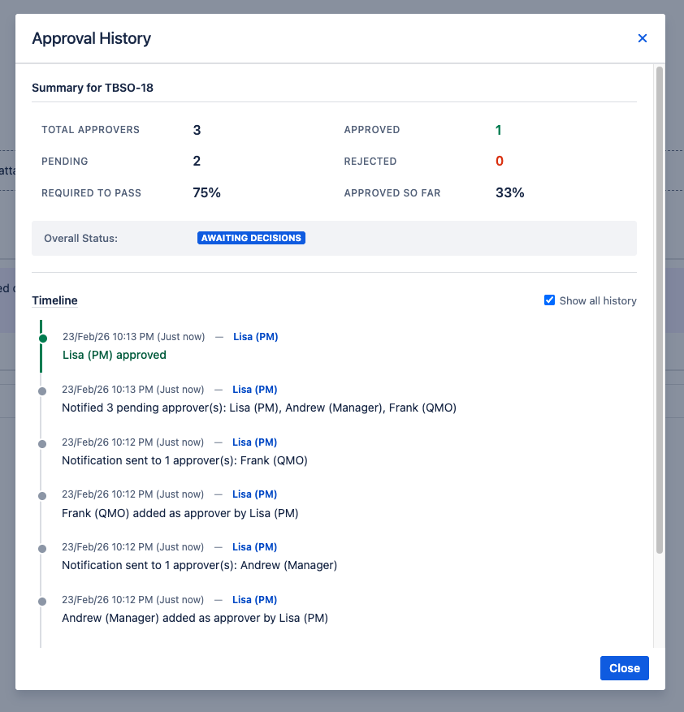

### Exporting Audit Data

1. Go to the global configuration page
2. Scroll to the **Audit & Compliance** section
3. Configure export filters (project, date range)
4. Click **Start Export**
5. Download the CSV when ready

The CSV includes all audit fields: issue key, project, action, actor, target, timestamps, SoD result, comments, reporter/assignee snapshots, and integrity hashes.

### Audit Record Integrity

Each audit record includes a SHA-256 hash computed from the record's key fields. This hash allows you to verify that records have not been tampered with. To validate:
1. Export the audit CSV
2. For each record, recompute the SHA-256 hash from the same fields
3. Compare with the stored hash — a mismatch indicates tampering

---

## REST API Reference

Business Sign-off exposes a REST API that enables automation, scripting, and integration with external tools. All endpoints use the base path:

```
/rest/bso-signoff/1.0
```

### Authentication

All endpoints require an authenticated Jira user. Use one of:

- **Basic Authentication** (simplest for scripts): `username:password`
- **Personal Access Tokens** (recommended for production automation): `Bearer <token>`

```bash
# Basic auth
curl -u admin:password https://jira.example.com/rest/bso-signoff/1.0/...

# Personal access token
curl -H "Authorization: Bearer ABCDEF123456" https://jira.example.com/rest/bso-signoff/1.0/...
```

### User Keys vs. Usernames

An important distinction when working with the API:

- **User key**: The internal Jira identifier for a user (e.g., `JIRAUSER10001` or `jsmith`). Used in all `userKey` fields in the REST API.
- **Username**: The login name displayed in the Jira UI (e.g., `jsmith`). Used when setting the BSO - Approvers custom field via Jira's standard REST API.

In most Jira installations, the user key and username are the same value. However, they can differ if a username was renamed after account creation. When in doubt, use Jira's user search API to look up the correct user key:

```bash
curl -u admin:password \
  "https://jira.example.com/rest/api/2/user/search?username=jsmith"
```

### Common Error Response Format

All endpoints return errors in a consistent format:

```json
{
  "success": false,
  "error": "Human-readable error message"
}
```

### License Read-Only Mode

When the plugin license is expired or has a seat overage past the grace period, all write operations (`POST`, `PUT`, `DELETE`) return `403 Forbidden` with the message "Plugin is in read-only mode due to license status." Read operations (`GET`) continue to work normally.

---

### Approver Management

These endpoints manage the list of approvers assigned to an issue.

#### Get Approvers

Retrieve all approvers for an issue.

```
GET /rest/bso-signoff/1.0/issue/{issueKey}/approvers
```

**Permissions**: `BROWSE_PROJECTS` on the issue.

**Example**:

```bash
curl -u admin:password \
  "https://jira.example.com/rest/bso-signoff/1.0/issue/PROJ-123/approvers"
```

**Response** (`200 OK`):

```json
{
  "approvers": [
    {
      "id": 101,
      "userKey": "jsmith",
      "displayName": "Jane Smith",
      "status": "APPROVED",
      "comment": "Looks good",
      "createdDate": "2026-01-15T10:30:00.000+0000",
      "decisionDate": "2026-01-16T14:22:00.000+0000"
    },
    {
      "id": 102,
      "userKey": "mbrown",
      "displayName": "Mike Brown",
      "status": "PENDING",
      "comment": null,
      "createdDate": "2026-01-15T10:30:00.000+0000",
      "decisionDate": null
    }
  ],
  "count": 2
}
```

| Status Code | Meaning |
|---|---|
| `200 OK` | Approvers retrieved |
| `401 Unauthorized` | Not authenticated |
| `403 Forbidden` | Insufficient permissions |
| `404 Not Found` | Issue not found |

---

#### Add a Single Approver

Add one approver to an issue.

```
POST /rest/bso-signoff/1.0/issue/{issueKey}/approvers
```

**Permissions**: Caller must be allowed to manage approvers (configured in global settings: reporter, assignee, or admin). Write operations blocked in license read-only mode.

**Request Body**:

| Field | Type | Required | Description |
|---|---|---|---|
| `userKey` | string | Yes | The Jira user key of the person to add as an approver |

**Example**:

```bash
curl -u admin:password -X POST \
  -H "Content-Type: application/json" \
  -d '{"userKey": "jsmith"}' \
  "https://jira.example.com/rest/bso-signoff/1.0/issue/PROJ-123/approvers"
```

**Response** (`201 Created`):

```json
{
  "success": true,
  "message": "Approver added",
  "approver": {
    "id": 103,
    "userKey": "jsmith",
    "displayName": "Jane Smith",
    "status": "ADDED",
    "createdDate": "2026-02-20T09:15:00.000+0000"
  }
}
```

The response includes a `Location` header pointing to the approvers list endpoint.

| Status Code | Meaning |
|---|---|
| `201 Created` | Approver added |
| `400 Bad Request` | Validation failed (user not found, not eligible, SoD violation) |
| `401 Unauthorized` | Not authenticated |
| `403 Forbidden` | Insufficient permissions or license read-only |
| `404 Not Found` | Issue not found |
| `409 Conflict` | User is already an approver |

---

#### Bulk Add Approvers

Add multiple approvers in a single operation with optional email notification.

```
POST /rest/bso-signoff/1.0/issue/{issueKey}/approvers/bulk
```

**Permissions**: Same as single add. Write operations blocked in license read-only mode.

**Request Body**:

| Field | Type | Required | Description |
|---|---|---|---|
| `userKeys` | array of strings | Yes | Jira user keys to add (maximum 50) |
| `notifyMode` | integer | No | `0` = no emails (default), `1` = individual email to each approver, `2` = single consolidated email to all |

**Example**:

```bash
curl -u admin:password -X POST \
  -H "Content-Type: application/json" \
  -d '{
    "userKeys": ["jsmith", "mbrown", "agarcia"],
    "notifyMode": 1
  }' \
  "https://jira.example.com/rest/bso-signoff/1.0/issue/PROJ-123/approvers/bulk"
```

**Response** (`200 OK`):

```json
{
  "added": ["jsmith", "mbrown"],
  "skipped": {
    "alreadyApprover": ["agarcia"],
    "ineligible": [],
    "notFound": []
  },
  "addedCount": 2,
  "skippedCount": 1,
  "notificationsSent": 2
}
```

The response tells you exactly which users were added and why any were skipped. This is useful for automation scripts that need to handle partial success.

| Status Code | Meaning |
|---|---|
| `200 OK` | Bulk operation completed (check `addedCount` and `skippedCount`) |
| `400 Bad Request` | Empty list or more than 50 user keys |
| `401 Unauthorized` | Not authenticated |
| `403 Forbidden` | Insufficient permissions or license read-only |
| `404 Not Found` | Issue not found |

---

#### Remove an Approver

Remove an approver from an issue.

```
DELETE /rest/bso-signoff/1.0/issue/{issueKey}/approvers/{userKey}
```

**Permissions**: Caller must be allowed to manage approvers. Decided approvers (APPROVED/RETURNED) can only be removed by Jira system admins, Jira admins, or project admins. Write operations blocked in license read-only mode.

**Example**:

```bash
curl -u admin:password -X DELETE \
  "https://jira.example.com/rest/bso-signoff/1.0/issue/PROJ-123/approvers/jsmith"
```

**Response** (`204 No Content`): Empty body on success.

| Status Code | Meaning |
|---|---|
| `204 No Content` | Approver removed |
| `401 Unauthorized` | Not authenticated |
| `403 Forbidden` | Insufficient permissions, issue completed, or license read-only |
| `404 Not Found` | Issue or approver not found |

**Note**: Approvers cannot be removed from issues in DONE or CLOSED status.

---

#### Check Modification Permission

Check whether approvers can be modified on an issue. Useful for automation scripts to pre-check before attempting changes.

```
GET /rest/bso-signoff/1.0/issue/{issueKey}/approvers/can-modify
```

**Permissions**: `BROWSE_PROJECTS` on the issue.

**Example**:

```bash
curl -u admin:password \
  "https://jira.example.com/rest/bso-signoff/1.0/issue/PROJ-123/approvers/can-modify"
```

**Response** (`200 OK`):

```json
{
  "canModify": true,
  "isEnabled": true,
  "isCompleted": false,
  "canManageApprovers": true
}
```

If `canModify` is `false`, the response includes a `reason` field explaining why (e.g., issue completed, license read-only, permission denied).

---

### Decisions

These endpoints record and manage approval decisions.

#### Record a Decision

Record an approval, return, or withdrawal for an approver.

```
POST /rest/bso-signoff/1.0/issue/{issueKey}/approvers/{userKey}/decision
```

**Permissions**: The authenticated user must be the approver identified by `{userKey}`. Write operations blocked in license read-only mode.

**Request Body**:

| Field | Type | Required | Description |
|---|---|---|---|
| `status` | string | Yes | `"APPROVED"`, `"RETURNED"`, or `"PENDING"` (withdrawal) |
| `comment` | string | No | Decision comment (max 450 characters). May be required by configuration. |

**Example — Approve with comment**:

```bash
curl -u jsmith:password -X POST \
  -H "Content-Type: application/json" \
  -d '{
    "status": "APPROVED",
    "comment": "Reviewed and approved. Meets all acceptance criteria."
  }' \
  "https://jira.example.com/rest/bso-signoff/1.0/issue/PROJ-123/approvers/jsmith/decision"
```

**Example — Return**:

```bash
curl -u jsmith:password -X POST \
  -H "Content-Type: application/json" \
  -d '{
    "status": "RETURNED",
    "comment": "Missing unit tests for the error handling path."
  }' \
  "https://jira.example.com/rest/bso-signoff/1.0/issue/PROJ-123/approvers/jsmith/decision"
```

**Example — Withdraw a previous decision**:

```bash
curl -u jsmith:password -X POST \
  -H "Content-Type: application/json" \
  -d '{
    "status": "PENDING",
    "comment": "Withdrawing approval pending re-review of security fix."
  }' \
  "https://jira.example.com/rest/bso-signoff/1.0/issue/PROJ-123/approvers/jsmith/decision"
```

**Response** (`200 OK`):

```json
{
  "success": true,
  "message": "Decision recorded",
  "approver": {
    "id": 101,
    "userKey": "jsmith",
    "status": "APPROVED",
    "comment": "Reviewed and approved. Meets all acceptance criteria.",
    "decisionDate": "2026-02-20T14:30:00.000+0000"
  }
}
```

| Status Code | Meaning |
|---|---|
| `200 OK` | Decision recorded |
| `400 Bad Request` | Invalid status value, comment required but missing, comment too long, or invalid transition |
| `401 Unauthorized` | Not authenticated |
| `403 Forbidden` | Not the approver, or license read-only |
| `404 Not Found` | Issue or approver not found |

**Notes**:
- Withdrawals (`PENDING`) always require a comment.
- Whether approval or return requires a comment depends on the global/project "Comment Requirements" setting.
- You cannot withdraw if the approver is already in `PENDING` or `ADDED` status.

---

#### Get Decision Configuration

Check comment requirements and the current user's approver status for an issue. Useful for building custom UIs.

```
GET /rest/bso-signoff/1.0/issue/{issueKey}/approvers/decision-config
```

**Permissions**: `BROWSE_PROJECTS` on the issue.

**Example**:

```bash
curl -u jsmith:password \
  "https://jira.example.com/rest/bso-signoff/1.0/issue/PROJ-123/approvers/decision-config"
```

**Response** (`200 OK`):

```json
{
  "commentRequiredForApproval": false,
  "commentRequiredForReturn": true,
  "isApprover": true,
  "currentStatus": "PENDING",
  "currentComment": null
}
```

---

### Notifications

Send email notifications and request re-reviews.

#### Notify Approvers

Send notification emails to approvers, or request a re-review (which resets decisions and notifies).

```
POST /rest/bso-signoff/1.0/issue/{issueKey}/approvers/notify
```

**Permissions**: Caller must be the issue reporter, assignee, Jira admin, or project admin. Write operations blocked in license read-only mode.

**Request Body (action-based format)**:

| Field | Type | Required | Description |
|---|---|---|---|
| `action` | string | Yes | `"SEND_NOTIFICATION"` or `"REQUEST_RE_REVIEW"` |
| `note` | string | No | Note to include with re-review request |

**Example — Send reminder to pending approvers**:

```bash
curl -u admin:password -X POST \
  -H "Content-Type: application/json" \
  -d '{"action": "SEND_NOTIFICATION"}' \
  "https://jira.example.com/rest/bso-signoff/1.0/issue/PROJ-123/approvers/notify"
```

**Example — Request re-review (resets all decisions)**:

```bash
curl -u admin:password -X POST \
  -H "Content-Type: application/json" \
  -d '{
    "action": "REQUEST_RE_REVIEW",
    "note": "Scope changed after the security review. Please re-review."
  }' \
  "https://jira.example.com/rest/bso-signoff/1.0/issue/PROJ-123/approvers/notify"
```

**Response** (`200 OK`):

```json
{
  "success": true,
  "notifiedCount": 3,
  "resetCount": 2,
  "approversNotified": ["Jane Smith", "Mike Brown", "Ana Garcia"],
  "lastNotifiedDate": "2026-02-20T15:00:00.000+0000",
  "message": "Notifications sent"
}
```

| Status Code | Meaning |
|---|---|
| `200 OK` | Notifications sent |
| `400 Bad Request` | No approvers to notify or no decisions to reset |
| `401 Unauthorized` | Not authenticated |
| `403 Forbidden` | Insufficient permissions or license read-only |
| `404 Not Found` | Issue not found |

---

#### Get Notification Status

Check notification counts and whether the current user can send notifications. Useful for pre-checking before calling the notify endpoint.

```
GET /rest/bso-signoff/1.0/issue/{issueKey}/approvers/notify-status
```

**Permissions**: `BROWSE_PROJECTS` on the issue.

**Example**:

```bash
curl -u admin:password \
  "https://jira.example.com/rest/bso-signoff/1.0/issue/PROJ-123/approvers/notify-status"
```

**Response** (`200 OK`):

```json
{
  "totalApprovers": 4,
  "addedCount": 0,
  "pendingCount": 2,
  "returnedCount": 1,
  "approvedCount": 1,
  "decidedCount": 2,
  "neverNotifiedCount": 0,
  "previouslyNotifiedCount": 2,
  "lastNotifiedDate": "2026-02-19T10:00:00.000+0000",
  "canNotify": true
}
```

---

### Approval Status

#### Get Issue Approval Status

Get the overall approval status, approver counts, and license information for an issue.

```
GET /rest/bso-signoff/1.0/issue/{issueKey}/status
```

**Permissions**: `BROWSE_PROJECTS` on the issue.

**Example**:

```bash
curl -u admin:password \
  "https://jira.example.com/rest/bso-signoff/1.0/issue/PROJ-123/status"
```

**Response** (`200 OK`):

```json
{
  "status": "Awaiting Decisions",
  "threshold": 75,
  "approverCount": 4,
  "addedCount": 0,
  "approvedCount": 2,
  "returnedCount": 0,
  "pendingCount": 2
}
```

When there are license issues, the response includes additional fields:

```json
{
  "status": "Awaiting Decisions",
  "threshold": 75,
  "approverCount": 4,
  "approvedCount": 2,
  "returnedCount": 0,
  "pendingCount": 2,
  "addedCount": 0,
  "licenseWarning": "expiring_soon",
  "licenseDaysRemaining": 7,
  "licenseReadOnly": false
}
```

**Overall status values**:

| Status | Meaning |
|---|---|
| `"Awaiting Decisions"` | Some approvers have not yet decided |
| `"Approval Passed"` | Approval threshold met |
| `"Returned"` | Threshold cannot be reached |
| `"No Approvers"` | No approvers assigned |

---

### Approval History

#### Get Audit History

Retrieve the approval history for an issue with pagination and optional filtering.

```
GET /rest/bso-signoff/1.0/issue/{issueKey}/history
```

**Permissions**: `BROWSE_PROJECTS` on the issue.

**Query Parameters**:

| Parameter | Type | Default | Description |
|---|---|---|---|
| `page` | integer | `1` | Page number (1-based) |
| `pageSize` | integer | `20` | Items per page (max 100) |
| `filter` | string | `"all"` | `"all"` for all entries, or `"decisions"` for decision-only entries |

**Example — Page 1, decisions only**:

```bash
curl -u admin:password \
  "https://jira.example.com/rest/bso-signoff/1.0/issue/PROJ-123/history?page=1&pageSize=10&filter=decisions"
```

**Response** (`200 OK`):

```json
{
  "summary": {
    "totalApprovers": 3,
    "pendingCount": 1,
    "approvedCount": 1,
    "returnedCount": 1,
    "currentApprovalPercentage": 33,
    "projectThreshold": 75,
    "projectThresholdDisplay": "75%",
    "overallStatus": "AWAITING_DECISIONS",
    "overallStatusDisplay": "Awaiting Decisions",
    "firstDecisionDate": "2026-02-15T10:00:00.000+0000",
    "lastDecisionDate": "2026-02-18T14:30:00.000+0000",
    "lastNotificationDate": "2026-02-14T09:00:00.000+0000"
  },
  "entries": [
    {
      "id": 501,
      "timestamp": "2026-02-18T14:30:00.000+0000",
      "timestampFormatted": "2 days ago",
      "timestampAbsolute": "18/Feb/26 2:30 PM",
      "action": "DECISION_APPROVED",
      "actorUserKey": "jsmith",
      "actorDisplayName": "Jane Smith",
      "actorEmail": "jsmith@example.com",
      "targetUserKey": "jsmith",
      "targetDisplayName": "Jane Smith",
      "targetEmail": "jsmith@example.com",
      "previousValue": "PENDING",
      "newValue": "APPROVED",
      "comment": "Looks good",
      "projectKey": "PROJ",
      "issueKey": "PROJ-123",
      "issueSummary": "Implement login page redesign",
      "issueType": "Story",
      "issuePriority": "Major",
      "issueStatus": "In Review",
      "reporterUserKey": "jdoe",
      "reporterDisplayName": "John Doe",
      "assigneeUserKey": "developer1",
      "assigneeDisplayName": "Dev User",
      "sodResult": null,
      "recordHash": "a1b2c3d4...",
      "actionDescription": "Jane Smith approved"
    }
  ],
  "pagination": {
    "page": 1,
    "pageSize": 10,
    "totalItems": 5,
    "totalPages": 1,
    "hasNextPage": false,
    "hasPreviousPage": false,
    "filter": "decisions"
  }
}
```

**History action types**:

| Action | Description |
|---|---|
| `APPROVER_ADDED` | User added as approver |
| `APPROVER_REMOVED` | User removed as approver |
| `DECISION_APPROVED` | Approver approved |
| `DECISION_RETURNED` | Approver returned |
| `DECISION_CHANGED` | Approver changed a previous decision |
| `DECISION_RESET` | Decision reset to PENDING |
| `STATUS_CHANGED` | Overall issue approval status changed |
| `NOTIFICATION_SENT` | First-time notification sent to approvers |
| `REMINDER_SENT` | Follow-up reminder sent to previously notified approvers |
| `RE_REVIEW_REQUESTED` | Re-review requested with decision reset |
| `CONFIG_CHANGED` | Configuration changed |

---

### Eligible Approver Search

Search for users who are eligible to be added as approvers. These endpoints apply the configured filters (eligible approver mode, project roles, user groups) and Segregation of Duties rules automatically.

#### Search by Issue (Edit/View Context)

Search for eligible approvers in the context of an existing issue. Automatically excludes users who are already approvers, fail SoD checks, or are not in eligible roles/groups.

```
GET /rest/bso-signoff/1.0/issue/{issueKey}/eligible-approvers/search
```

**Permissions**: `BROWSE_PROJECTS` on the issue, plus caller must be able to add approvers.

**Query Parameters**:

| Parameter | Type | Default | Description |
|---|---|---|---|
| `query` | string | (empty) | Search text (matches username, display name, email) |
| `maxResults` | integer | `10` | Maximum results to return (1–50) |
| `startAt` | integer | `0` | Offset for pagination (browse mode) |

**Example — Search for users matching "smith"**:

```bash
curl -u admin:password \
  "https://jira.example.com/rest/bso-signoff/1.0/issue/PROJ-123/eligible-approvers/search?query=smith&maxResults=10"
```

**Example — Browse all eligible approvers (no search query)**:

```bash
curl -u admin:password \
  "https://jira.example.com/rest/bso-signoff/1.0/issue/PROJ-123/eligible-approvers/search?maxResults=20&startAt=0"
```

**Response** (`200 OK`):

```json
{
  "users": [
    {
      "key": "jsmith",
      "name": "jsmith",
      "displayName": "Jane Smith",
      "avatarUrl": "https://jira.example.com/secure/useravatar?ownerId=jsmith"
    }
  ],
  "total": 1,
  "hasMore": false
}
```

Use `hasMore` to determine whether to fetch the next page with a higher `startAt` value.

---

#### Search by Project (Create Issue Context)

Search for eligible approvers in the context of a project, before an issue exists. Use this when building automation that pre-populates approvers at issue creation time.

```
GET /rest/bso-signoff/1.0/project/{projectKey}/eligible-approvers/search
```

**Permissions**: `BROWSE_PROJECTS` on the project.

**Query Parameters**:

| Parameter | Type | Default | Description |
|---|---|---|---|
| `query` | string | (empty) | Search text |
| `maxResults` | integer | `10` | Maximum results (1–50) |
| `startAt` | integer | `0` | Offset for pagination |
| `reporter` | string | (none) | Reporter user key — used for SoD filtering |
| `assignee` | string | (none) | Assignee user key — used for SoD filtering |

**Example — Search with SoD context**:

```bash
curl -u admin:password \
  "https://jira.example.com/rest/bso-signoff/1.0/project/PROJ/eligible-approvers/search?query=smith&reporter=jdoe&assignee=mbrown"
```

**Response**: Same format as the issue-based search endpoint above.

**Note**: Since no issue exists yet, pass `reporter` and `assignee` as query parameters so the endpoint can apply SoD rules correctly. If omitted, SoD filtering is skipped.

---

### Approver Validation

#### Validate a Potential Approver

Pre-check whether a specific user can be added as an approver to an issue. Returns a clear `valid` flag and reason if not.

```
GET /rest/bso-signoff/1.0/issue/{issueKey}/approvers/validate?userKey={userKey}
```

**Permissions**: Caller must be able to add approvers.

**Example**:

```bash
curl -u admin:password \
  "https://jira.example.com/rest/bso-signoff/1.0/issue/PROJ-123/approvers/validate?userKey=jsmith"
```

**Response** (`200 OK`):

```json
{
  "valid": true,
  "userKey": "jsmith",
  "displayName": "Jane Smith"
}
```

If the user cannot be added, the response includes a `400` status with an error message explaining why (e.g., SoD violation, not eligible, already an approver).

---

### Configuration

#### Get Global Configuration

Retrieve the full global plugin configuration. Useful for automation that needs to understand current settings.

```
GET /rest/bso-signoff/1.0/config/global
```

**Permissions**: `SYSTEM_ADMIN` global permission.

**Example**:

```bash
curl -u admin:password \
  "https://jira.example.com/rest/bso-signoff/1.0/config/global"
```

**Response** (`200 OK`):

```json
{
  "pluginEnabled": true,
  "globalFinishingMode": false,
  "sodAssigneeCannotApprove": true,
  "sodReporterCannotApprove": true,
  "sodAllowProjectOverride": false,
  "approverMgmtAllowReporter": true,
  "approverMgmtAllowAssignee": true,
  "approverMgmtAllowAdministrators": true,
  "commentRequiredOn": "RETURN_ONLY",
  "commentRequiredAllowProjectOverride": true,
  "approvalThreshold": 75,
  "approvalThresholdAllowProjectOverride": true,
  "approvalThresholdMinimum": 50,
  "eligibleApproverMode": "ALL_USERS",
  "eligibleApproverFilterByRole": false,
  "eligibleApproverRoleIds": "",
  "eligibleApproverFilterByGroup": false,
  "eligibleApproverGroupNames": "",
  "eligibleApproverAllowProjectOverride": false
}
```

---

#### Update Global Configuration

Update global plugin configuration settings.

```
PUT /rest/bso-signoff/1.0/config/global
```

**Permissions**: `SYSTEM_ADMIN` global permission.

**Request Body**: Include only the fields you want to update. Fields use the same names as the GET response.

**Example — Change threshold and SoD settings**:

```bash
curl -u admin:password -X PUT \
  -H "Content-Type: application/json" \
  -d '{
    "approvalThreshold": 100,
    "sodAssigneeCannotApprove": true,
    "sodReporterCannotApprove": true
  }' \
  "https://jira.example.com/rest/bso-signoff/1.0/config/global"
```

**Response** (`200 OK`):

```json
{
  "success": true,
  "message": "Configuration updated"
}
```

| Status Code | Meaning |
|---|---|
| `200 OK` | Configuration updated |
| `400 Bad Request` | Validation error |
| `401 Unauthorized` | Not authenticated |
| `403 Forbidden` | Not a system admin |

---

#### Get Project Configuration

Retrieve the effective configuration for a project, with global overrides resolved.

```
GET /rest/bso-signoff/1.0/config/project/{projectKey}
```

**Permissions**: `ADMINISTER_PROJECTS` on the project.

**Example**:

```bash
curl -u admin:password \
  "https://jira.example.com/rest/bso-signoff/1.0/config/project/PROJ"
```

**Response** (`200 OK`):

```json
{
  "projectKey": "PROJ",
  "projectId": 10001,
  "enabled": true,
  "panelVisibility": "ALL",
  "approvalRequired": true,
  "requiredIssueTypeIds": [],
  "approvalThreshold": 75,
  "approvalThresholdRaw": null,
  "approvalThresholdAllowProjectOverride": true,
  "commentRequiredOn": "RETURN_ONLY",
  "commentRequiredAllowProjectOverride": true,
  "sodAssigneeCannotApprove": true,
  "sodReporterCannotApprove": true,
  "emailApproverOnAdd": true,
  "emailRequestorOnOutcome": "APPROVED_OR_RETURNED",
  "emailRequestorOnDecision": "NEVER",
  "emailAssigneeOnOutcome": "APPROVED_OR_RETURNED",
  "emailAssigneeOnDecision": "NEVER",
  "eligibleApproverMode": "ALL_USERS",
  "eligibleApproverFilterByRole": false,
  "eligibleApproverRoleIds": "",
  "eligibleApproverFilterByGroup": false,
  "eligibleApproverGroupNames": ""
}
```

**Notes**:
- Fields ending in `Raw` show the project's own override value (`null` means "inherit from global"). Fields without `Raw` show the resolved effective value.
- `panelVisibility` values: `ALL` (show on all issue types) or `SELECTED` (show only on issue types listed in `requiredIssueTypeIds`)
- Email notification option values: `APPROVED_ONLY`, `RETURNED_ONLY`, `APPROVED_OR_RETURNED`, `NEVER`
- Eligible approver settings are resolved from project override or global default based on the `eligibleApproverAllowProjectOverride` global setting

---

### Audit CSV Export

Export approval history across projects and date ranges for compliance reporting.

#### Start an Export

Start an async background export task.

```
POST /rest/bso-signoff/1.0/audit/export/start
```

**Permissions**: `SYSTEM_ADMIN` global permission. Write operations blocked in license read-only mode.

**Request Body**:

| Field | Type | Required | Description |
|---|---|---|---|
| `projectKeys` | array of strings | Yes | Project keys to include (max 50) |
| `fromDate` | string | Yes | Start date in `yyyy-MM-dd` format |
| `toDate` | string | Yes | End date in `yyyy-MM-dd` format (max 365-day range) |
| `decisionsOnly` | boolean | No | When `true`, export only decision records (approvals/returns). Default: `true` |

**Example**:

```bash
curl -u admin:password -X POST \
  -H "Content-Type: application/json" \
  -d '{
    "projectKeys": ["PROJ", "SEC"],
    "fromDate": "2026-01-01",
    "toDate": "2026-02-20",
    "decisionsOnly": false
  }' \
  "https://jira.example.com/rest/bso-signoff/1.0/audit/export/start"
```

**Response** (`200 OK`):

```json
{
  "taskId": "a1b2c3d4-e5f6-7890-abcd-ef1234567890",
  "status": "RUNNING"
}
```

Save the `taskId` — you need it to check progress and download the file.

| Status Code | Meaning |
|---|---|
| `200 OK` | Export started |
| `400 Bad Request` | Invalid dates, too many projects, or date range exceeds 365 days |
| `401 Unauthorized` | Not authenticated |
| `403 Forbidden` | Not a system admin, or license read-only |
| `503 Service Unavailable` | Too many concurrent exports (max 5) |

---

#### Check Export Status

Poll the status of a running export task.

```
GET /rest/bso-signoff/1.0/audit/export/status/{taskId}
```

**Permissions**: `SYSTEM_ADMIN` global permission.

**Example**:

```bash
curl -u admin:password \
  "https://jira.example.com/rest/bso-signoff/1.0/audit/export/status/a1b2c3d4-e5f6-7890-abcd-ef1234567890"
```

**Response — In progress**:

```json
{
  "taskId": "a1b2c3d4-e5f6-7890-abcd-ef1234567890",
  "status": "RUNNING",
  "progress": 65
}
```

**Response — Completed**:

```json
{
  "taskId": "a1b2c3d4-e5f6-7890-abcd-ef1234567890",
  "status": "COMPLETED",
  "progress": 100,
  "downloadUrl": "/rest/bso-signoff/1.0/audit/export/download/a1b2c3d4-e5f6-7890-abcd-ef1234567890"
}
```

**Response — Failed**:

```json
{
  "taskId": "a1b2c3d4-e5f6-7890-abcd-ef1234567890",
  "status": "FAILED",
  "errorMessage": "No audit records found for the specified criteria"
}
```

---

#### Download Export File

Download the completed CSV export file.

```
GET /rest/bso-signoff/1.0/audit/export/download/{taskId}
```

**Permissions**: `SYSTEM_ADMIN` global permission.

**Example**:

```bash
curl -u admin:password -o audit-export.csv \
  "https://jira.example.com/rest/bso-signoff/1.0/audit/export/download/a1b2c3d4-e5f6-7890-abcd-ef1234567890"
```

The file is streamed as `text/csv; charset=UTF-8` with a UTF-8 BOM. The `Content-Disposition` header includes a date-stamped filename.

| Status Code | Meaning |
|---|---|
| `200 OK` | CSV file downloaded |
| `400 Bad Request` | Export task is not yet completed |
| `401 Unauthorized` | Not authenticated |
| `403 Forbidden` | Not a system admin |
| `404 Not Found` | Task not found or export file missing |

---

### Automation Recipes

Below are end-to-end examples for common automation scenarios.

#### Recipe: Create an Issue with Pre-Populated Approvers (Single Step)

Use Jira's standard REST API to create an issue with the BSO - Approvers custom field already populated. The plugin's sync listener detects the field values on the `ISSUE_CREATED` event and automatically creates the approver records.

**Important**: When setting the BSO - Approvers field via Jira's issue create API, pass **usernames** (not user keys) in the `"name"` field — this is what Jira's MultiUserCFType expects.

```bash
# Find the custom field ID for "BSO - Approvers"
# (check Jira Admin > Custom Fields, or use the REST API)
FIELD_ID="customfield_10100"

curl -u admin:password -X POST \
  -H "Content-Type: application/json" \
  -d '{
    "fields": {
      "project": {"key": "PROJ"},
      "issuetype": {"name": "Story"},
      "summary": "Implement login page redesign",
      "assignee": {"name": "developer1"},
      "'$FIELD_ID'": [
        {"name": "jsmith"},
        {"name": "mbrown"},
        {"name": "agarcia"}
      ]
    }
  }' \
  "https://jira.example.com/rest/api/2/issue"
```

The plugin automatically adds all three users as approvers when the issue is created. No separate API call is needed.

**Note**: To find your custom field ID, go to **Jira Administration > Custom Fields**, find "BSO - Approvers", and note the numeric ID in the URL when you click Configure — the field ID is `customfield_NNNNN`.

---

#### Recipe: Create an Issue Then Add Approvers (Two Steps)

If you prefer explicit control and visibility into which approvers were added vs. skipped, use the bulk add endpoint after creating the issue.

```bash
# Step 1: Create the issue
RESPONSE=$(curl -s -u admin:password -X POST \
  -H "Content-Type: application/json" \
  -d '{
    "fields": {
      "project": {"key": "PROJ"},
      "issuetype": {"name": "Story"},
      "summary": "Implement login page redesign"
    }
  }' \
  "https://jira.example.com/rest/api/2/issue")

ISSUE_KEY=$(echo $RESPONSE | python3 -c "import sys,json; print(json.load(sys.stdin)['key'])")

# Step 2: Add approvers via bulk endpoint (uses user keys)
curl -u admin:password -X POST \
  -H "Content-Type: application/json" \
  -d '{
    "userKeys": ["jsmith", "mbrown", "agarcia"],
    "notifyMode": 1
  }' \
  "https://jira.example.com/rest/bso-signoff/1.0/issue/$ISSUE_KEY/approvers/bulk"
```

This approach gives you the detailed response showing exactly which users were added and which were skipped (and why).

---

#### Recipe: Copy Approvers from One Issue to Another

Copy the approvers from a source issue to a target issue — useful for cloning approval boards across related issues.

```bash
SOURCE_ISSUE="PROJ-100"
TARGET_ISSUE="PROJ-200"

# Step 1: Get approvers from source issue
APPROVERS=$(curl -s -u admin:password \
  "https://jira.example.com/rest/bso-signoff/1.0/issue/$SOURCE_ISSUE/approvers")

# Step 2: Extract user keys
USER_KEYS=$(echo $APPROVERS | python3 -c "
import sys, json
data = json.load(sys.stdin)
keys = [a['userKey'] for a in data['approvers']]
print(json.dumps(keys))
")

# Step 3: Add to target issue
curl -u admin:password -X POST \
  -H "Content-Type: application/json" \
  -d "{\"userKeys\": $USER_KEYS, \"notifyMode\": 1}" \
  "https://jira.example.com/rest/bso-signoff/1.0/issue/$TARGET_ISSUE/approvers/bulk"
```

---

#### Recipe: Export Audit Data for Compliance

A scripted workflow for exporting audit data and waiting for completion.

```bash
# Step 1: Start the export
RESPONSE=$(curl -s -u admin:password -X POST \
  -H "Content-Type: application/json" \
  -d '{
    "projectKeys": ["PROJ", "SEC", "INFRA"],
    "fromDate": "2026-01-01",
    "toDate": "2026-03-31"
  }' \
  "https://jira.example.com/rest/bso-signoff/1.0/audit/export/start")

TASK_ID=$(echo $RESPONSE | python3 -c "import sys,json; print(json.load(sys.stdin)['taskId'])")

# Step 2: Poll until complete
while true; do
  STATUS=$(curl -s -u admin:password \
    "https://jira.example.com/rest/bso-signoff/1.0/audit/export/status/$TASK_ID")
  STATE=$(echo $STATUS | python3 -c "import sys,json; print(json.load(sys.stdin)['status'])")

  if [ "$STATE" = "COMPLETED" ]; then
    echo "Export complete. Downloading..."
    break
  elif [ "$STATE" = "FAILED" ]; then
    echo "Export failed."
    echo $STATUS
    exit 1
  fi

  PROGRESS=$(echo $STATUS | python3 -c "import sys,json; print(json.load(sys.stdin).get('progress', 0))")
  echo "Progress: ${PROGRESS}%"
  sleep 5
done

# Step 3: Download the file
curl -u admin:password -o "audit-export-Q1-2026.csv" \
  "https://jira.example.com/rest/bso-signoff/1.0/audit/export/download/$TASK_ID"

echo "Saved to audit-export-Q1-2026.csv"
```

---

### Approver Status Values Reference

| Status | Description |
|---|---|
| `ADDED` | Approver has been added but not yet notified |
| `PENDING` | Approver has been notified and is awaiting their decision |
| `APPROVED` | Approver has approved |
| `RETURNED` | Approver has returned |

### Comment Required Settings Reference

| Value | Meaning |
|---|---|
| `ALL` | Comment required for both approval and return |
| `APPROVAL_ONLY` | Comment required only when approving |
| `RETURN_ONLY` | Comment required only when returning |
| `NONE` | Comments are always optional |

### Email Notification Option Values Reference

| Value | Meaning |
|---|---|
| `APPROVED_ONLY` | Notify only on approval |
| `RETURNED_ONLY` | Notify only on return |
| `APPROVED_OR_RETURNED` | Notify on both approval and return |
| `NEVER` | Never send notifications |

### JQL Functions Reference

Business Sign-off registers the following JQL functions:

#### `bsoApprovers()`

Find issues where a specific user is an approver.

```
issue in bsoApprovers("username")
```

Returns all issues where the specified user is listed as an approver (any status: ADDED, PENDING, APPROVED, RETURNED).

#### `bsoApproverStatus()`

Find issues where a specific user has a specific approver status.

```
issue in bsoApproverStatus("username", "STATUS")
```

Valid status values: `ADDED`, `PENDING`, `APPROVED`, `RETURNED`

**Examples**:
- `issue in bsoApproverStatus("jsmith", "APPROVED")` — issues where jsmith has approved
- `issue in bsoApproverStatus("jsmith", "PENDING")` — issues where jsmith hasn't decided yet

#### `bsoStatus()` (Not Yet Functional)

This JQL function is registered but currently returns empty results. Use the BSO - Status custom field for issue-level approval status queries instead:

```
"BSO - Status" = "Approval Passed"
"BSO - Status" = "Returned"
"BSO - Status" = "Awaiting Decisions"
"BSO - Status" IS EMPTY
```

---

## Troubleshooting

### Plugin Not Appearing on Issues

1. Verify the plugin is enabled globally (global config page)
2. Verify the plugin is enabled for the specific project (project config page)
3. Check panel visibility settings — the issue type may not be included
4. Verify the user has BROWSE permission on the issue
5. Check for license issues on the **License Administration** page

### Approvers Cannot Be Added

1. Verify the user has EDIT permission on the project
2. Check eligible approver filters — the user may not be in a matching role/group
3. Check SoD rules — the user may be the reporter or assignee
4. Verify the plugin license is valid

### Workflow Functions Not Working

1. Verify the workflow is published (draft workflows are not active)
2. Check the workflow function configuration (correct usernames, role/group names)
3. Enable debug logging and review `atlassian-jira.log` for detailed error messages
4. Verify the plugin is enabled for the project

### JQL Functions Not Returning Results

1. Run a full Jira re-index after first installing the plugin
2. Verify the BSO - Status custom field exists and has a searcher configured
3. Check JQL syntax: `issue in bsoApprovers("username")`, `issue in bsoApproverStatus("username", "APPROVED")`
4. **Note**: The `bsoStatus()` JQL function is registered but not yet functional — it returns empty results. Use the BSO - Status custom field in JQL instead (e.g., `"BSO - Status" = "Approval Passed"`)

### Email Notifications Not Sending

1. Verify Jira's outgoing mail is configured and working (test email from admin)
2. Check project-level email notification settings
3. Verify the recipient user has an email address in their Jira profile
4. Enable debug logging and check for mail-related log entries

### Enabling Debug Logging

1. Go to global configuration
2. Toggle **Debug Logging** to ON
3. Set an expiry duration
4. Reproduce the issue
5. Check `atlassian-jira.log` for entries with the `io.cahaba.jira.signoff` logger prefix
6. Debug logging automatically expires to prevent log bloat


---

*Cahaba Forge LLC | cahabaforge.com*
